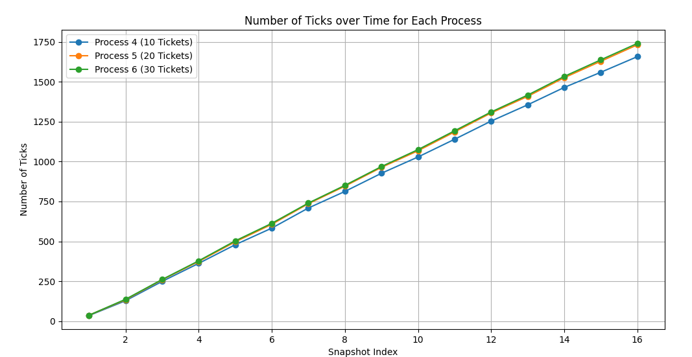

Discuss four modifications you made to the xv6 code; when appropriate, use the [git diff] command to compute the changes between the original xv6 code and your modified version.

1. Show the diff and discuss the data structure you use to keep track of process tickets

```bash
kernel/proc.h
diff --git a/kernel/proc.h b/kernel/proc.h
index 77d216b..5d12854 100644
--- a/kernel/proc.h
+++ b/kernel/proc.h
@@ -104,7 +104,6 @@ struct proc {
   struct file *ofile[NOFILE];  // Open files
   struct inode *cwd;           // Current directory
   char name[16];               // Process name (debugging)
-
   int tickets;                 // Número de tickets para cada processo
   int ticks;                   // Numero de ticks que o processo ja rodou
 };
```

Foi adicionado uma variável inteira na estrutura proc do arquivo proc.h para armazenar o número de tickets de cada processo.

2. Show the diff and discuss the code you use to choose winning tickets (the random number generator)

```bash
-unsigned long int seed = 1;
-
-void
-set_seed(unsigned long int new_seed)
-{
-  seed = new_seed;
-}
-
-int
-rand(void) {
-  seed = seed * 1103515245 + 12345;
-  return (unsigned int)(seed/65536) % 32768;
-}
-
-int get_winner(int n)
-{
-  return rand() % (n + 1);
-}
-

```

O pseudo gerador de números aleatórios foi implementado utilizando o algoritmo LCG. A função rand() gera um número aleatório usando o algoritmo, a função set_seed() permite trocar a seed e a função get_winner() retorna um número aleatório entre 0 e n, para escolher o ticket vencedor do total de número de tickets.

3. Discuss how fill in the [pstat] structure

```c
int
getpinfo(uint64 ps)
{
  struct pstat stat;
  for (int i = 0; i < NPROC; i++) {
    stat.tickets[i] = (&proc[i])->tickets;
    stat.pid[i] = (&proc[i])->pid;
    stat.inuse[i] = (&proc[i])->state == UNUSED ? 0 : 1;
    stat.ticks[i] = (&proc[i])->ticks;
  }

  if (copyout(myproc()->pagetable, ps, (char *)&stat, sizeof(stat)) < 0) {
    return -1;
  }
  return 0;
}
```

A função getpinfo preenche uma instância da estrutura pstat com o estado atual de cada processo, iterando sobre todos os processos e armazenando na estrutura. Após preencher a estrutura, a função copyout() é usada para transferir as informações do espaço do kernel para o espaço do usuário, com endereço de destino informado por parâmetro.

4. Choose one more change you find relevant to discuss

// Look in the process table for an UNUSED proc.
// If found, initialize state required to run in the kernel,
// and return with p->lock held.
// If there are no free procs, or a memory allocation fails, return 0.

```c
static struct proc*
allocproc(void)
{
  struct proc *p;

  for(p = proc; p < &proc[NPROC]; p++) {
    acquire(&p->lock);
    if(p->state == UNUSED) {
      goto found;
    } else {
      release(&p->lock);
    }
  }
  return 0;

found:
  p->pid = allocpid();
  p->state = USED;
  p->tickets = 1;
  p->ticks = 0;
  ...
  return p;
}
```

Na função allocproc, responsável por alocar e inicializar um novo processo, definimos os valores iniciais de tickets e tickes de um processo, para 1 e 0, respesctivamente.

Além disso, na função fork, sempre que um processo filho é criado, definimos o número de tickets igual ao do processo pai:

```c
  np->tickets = p->tickets;

```

5. How you tested your scheduler

O escalonador foi testado com o código getpinfo.c, que gera o número de ticks utilizado pelos processos a cada intervalo de tempo. A saída é da seguinte forma:

```bash
PID	TICKETS	TICKS
3	    10	95
4	    20	100
5	    30	99

3	    10	190
4	    20	199
5	    30	199

3	    10	282
4	    20	297
5	    30	299

3	    10	376
4	    20	395
5	    30	398

```

Além disso, o código settickets.c testa a função settickets, informando o valor de retorno dela, se é 0 ou -1.

6. Discuss the graph described at the end of the assignment description
    
   
O gráfico indica uma maior proporção de ticks para o processo com 30 tickets, seguido pelo com 20 tickets e por fim o de 10 tickets.
Esse comportamento indica que a proporção de ticks está proporcional ao número de tickets e que o lottery scheduler está funcionando corretamente.
